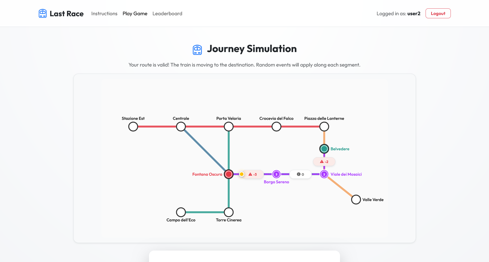
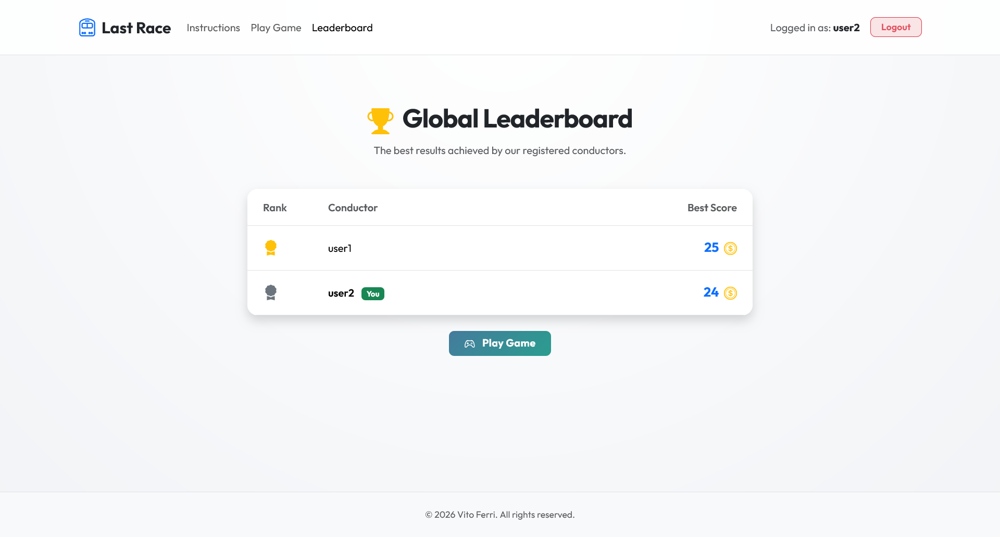

# Exam #1: "Last Race"
## Student: s360726 FERRI VITO 

## React Client Application Routes

- Route `/`: Home and landing page. Displays the complete game instructions. If the user is not authenticated, it renders the sign-in form. If authenticated, it displays options to play the game or view the leaderboard.
- Route `/game`: Interactive game page (guarded, requires login). Coordinates the four wizard phases: Setup (study map), Planning (90-second route construction on hidden lines), Execution (step-by-step train simulation), and Result (final score readout).
- Route `/ranking`: Global leaderboard rankings page (guarded, requires login). Displays the highest scores achieved by all registered users.

## API Server

- **POST `/api/sessions`**
  - Authenticates user credentials.
  - Request body: `{ "username": "user1", "password": "password123" }`
  - Response: status 200 `{ "id": 1, "username": "user1" }` or status 401.
- **DELETE `/api/sessions/current`**
  - Terminates the current active session.
  - Response: status 204.
- **GET `/api/sessions/current`**
  - Retrieves current logged-in user details.
  - Response: status 200 `{ "id": 1, "username": "user1" }` or status 401.
- **GET `/api/network`**
  - Retrieves the metro network configurations.
  - Response: `{ "stations": [...], "lines": [...], "connections": [...] }`.
- **GET `/api/events`**
  - Retrieves the list of all available gameplay random events.
  - Response: `[ { "id": 1, "description": "...", "effect": 1 }, ... ]`.
- **GET `/api/ranking`**
  - Retrieves the leaderboard rankings sorted by best score descending.
  - Response: `[ { "username": "user1", "bestScore": 25 }, ... ]`.
- **POST `/api/games`**
  - Starts a new game session. Generates random start/destination stations with distance >= 3 segments and stores them in the session.
  - Response: `{ "gameId": "d04a60ea-52b8-4c12-9c16-cf4c3dbf98d6", "startStation": "Belvedere", "destinationStation": "Centrale" }`.
- **POST `/api/games/submit`**
  - Validates the submitted route (time limit, continuity, no reused segments, line changes only at interchange stations). If valid, executes step-by-step and returns events. Saves final score.
  - Request body: `{ "gameId": "d04a60ea-52b8-4c12-9c16-cf4c3dbf98d6", "route": ["Belvedere", "Viale dei Mosaici", "Borgo Sereno", "Fontana Oscura", "Centrale"] }`
  - Response: `{ "valid": true, "errorMsg": "", "score": 17, "steps": [...] }`.

## Database Tables

- **Table `users`**: Contains authenticated users credentials. Fields: `id` (INTEGER PRIMARY KEY), `username` (TEXT UNIQUE), `hash` (TEXT), `salt` (TEXT).
- **Table `games`**: Records game scores. Fields: `id` (INTEGER PRIMARY KEY), `user_id` (INTEGER REFERENCES users(id)), `score` (INTEGER), `timestamp` (TEXT).
- **Table `stations`**: Metro stations layout coordinates and details. Fields: `name` (TEXT PRIMARY KEY), `x` (INTEGER), `y` (INTEGER), `is_interchange` (INTEGER).
- **Table `lines`**: Metro lines details. Fields: `name` (TEXT PRIMARY KEY), `color` (TEXT).
- **Table `connections`**: Metro rail segments between stations. Fields: `id` (INTEGER PRIMARY KEY), `station1` (TEXT REFERENCES stations(name)), `station2` (TEXT REFERENCES stations(name)), `line_name` (TEXT REFERENCES lines(name)).
- **Table `events`**: Travel events. Fields: `id` (INTEGER PRIMARY KEY), `description` (TEXT), `effect` (INTEGER).

## Main React Components

- **`App`** (`App.jsx`): Central routing coordinator. Includes auth guards for protected pages.
- **`AuthProvider`** (`contexts/AuthContext.jsx`): Manages global login/logout sessions and checks active credentials on mount.
- **`Navigation`** (`components/Navigation.jsx`): Responsive header navbar displaying branding, route links, active username, and logout actions.
- **`LoginForm`** (`components/LoginForm.jsx`): Sign-in form card utilizing React 19's `useActionState` hook for pending and validation states.
- **`MetroMap`** (`components/MetroMap.jsx`): Interactive SVG map. Renders stations and connections dynamically based on current game phase and route selections.
- **`Game`** (`pages/Game.jsx`): Game loop manager representing Setup, Planning (with 90s countdown), Execution (with delayed visual steps), and Result panels.
- **`Ranking`** (`pages/Ranking.jsx`): Leaderboard page fetching rankings and rendering a responsive leaderboard table.

## Screenshot

## Users Credentials

- **username:** `user1`, **password:** `password123` (played games)
- **username:** `user2`, **password:** `password456` (played games)
- **username:** `user3`, **password:** `password789` (no games played)

## Use of AI Tools
AI was used to write initial express validation middleware boilerplate, review major code changes, and keep documentation up to date.
